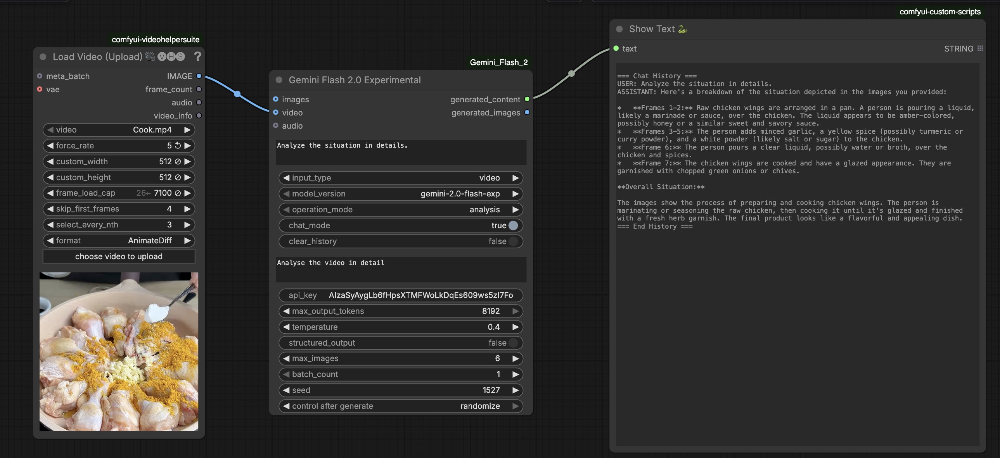

# ComfyUI Video Analysis (Gemini Flash)

## What it is

A minimal **ComfyUI** workflow that turns a local video into a **clear, human-readable analysis** by sampling video frames and sending them to **Gemini Flash** (multimodal Video Language Model).

You get a practical “what is happening in this clip?” description without building a separate app, backend, or UI.

## How it works

**Pipeline (in ComfyUI):**

`VHS_LoadVideo → frame sampling → Gemini Flash (video) → ShowText`

1. **Load video** from `ComfyUI/input/` using **VideoHelperSuite** (`VHS_LoadVideo`).
2. **Sample frames** (more than 6; configurable with `frame_load_cap` and `select_every_nth`).
3. **Send frames to Gemini** with a task prompt (e.g., “Analyze the situation in details.”).
4. **Display the analysis** inside ComfyUI using a text viewer node.

## Why it matters

This pattern is a reusable building block for real systems:

- **Anomaly detection + temporal segmentation (next step):** extend from whole-clip summaries to **time-windowed** analysis (e.g., 15-second chunks) and export **per-segment JSON** with timestamps.
- **Training & compliance:** convert video into structured summaries for **healthcare**, **industrial**, and other professional training workflows (SOP adherence, safety audits, incident reviews).
- **Video analytics systems engineering:** a concrete, end-to-end example of **video ingestion → sampling → multimodal reasoning → outputs**, ready to evolve into scalable pipelines (batch jobs, caching, evaluation, monitoring).

**Scope:**
- ✅ Load video
- ✅ Sample more than 6 frames (configurable)
- ✅ Send frames to Gemini and returns understanding of the video frames in text output
- ✅ Show understanding of the video per segment in ComfyUI
- ✅ Show results in ComfyUI

---


## What you get

A ComfyUI workflow like:

`VHS_LoadVideo → Gemini Flash (video) → Shows understanding of the video in text`

Example output:

> The image frames extracted from the video show someone preparing raw chicken wings… liquid poured… diced garlic added…

---

## Requirements

- **ComfyUI Desktop** (tested with ComfyUI 0.9.1 on macOS)
- **VideoHelperSuite** (VHS) for `VHS_LoadVideo`
- **Gemini Flash custom node** (the Gemini repo node)
- A **Gemini API key** (Google AI Studio / Gemini API)

---

## Install

### 1) Install the custom nodes

Put these folders into:

`ComfyUI/custom_nodes/`

- `comfyui-videohelpersuite`
- `ComfyUI-Gemini_Flash_2.0_Exp` (or your fork)

Restart ComfyUI.

> If you are using ComfyUI-Manager, install both from Manager and restart.

### 2) Install Python dependencies (must be in ComfyUI’s venv)

Use **the same Python executable ComfyUI runs**, e.g.:

```bash
/Users/<you>/Documents/ComfyUI/.venv/bin/python -m pip install -U google-genai google-generativeai pillow
```

---

## API Key Configuration

Two valid approaches:

### Option A — `config.json` (recommended)
Create `config.json` inside the Gemini node folder:

```json
{
  "GEMINI_API_KEY": "YOUR_KEY_HERE"
}
```

### Option B — enter key in the node UI
Some setups are more reliable when the key is entered directly in the node.

---

## Workflow Setup

### 1) Put your video in ComfyUI input directory
Copy video into:

`ComfyUI/input/`

### 2) Load the workflow JSON
Load from:

`workflows/gemini_video_analysis.json`

### 3) Configure `VHS_LoadVideo` (important)
Key settings to avoid typical VHS errors and improve coherence:

- `force_rate`: **8** *(do not leave empty / null)*
- `custom_width/custom_height`: **512** (or 640)
- `frame_load_cap`: **24–48** (increase frames vs default “6” behavior)
- `select_every_nth`: **1–4** (controls sampling density)
- `skip_first_frames`: optional (e.g., 0–10)

**Recommended presets:**
- Short clips (10–30s): `frame_load_cap=24`, `select_every_nth=1`
- Longer clips (60–120s): `frame_load_cap=32–48`, `select_every_nth=2–4`

### 4) Configure Gemini Node
- `input_type`: `video`
- prompt example:
  - `Analyze the situation in details.`
- set `max_output_tokens`: 512–1200 (don’t leave it at 8192 unless needed)

---

## Screenshot


---

## Troubleshooting (common issues)

### 1) “Cannot execute because a node is missing the class_type property (Node #48)”
**Cause:** The workflow node `"type"` doesn’t match the backend `NODE_CLASS_MAPPINGS` key. This happens when a workflow was built with a different node name than what your installed node registers.

**Fix (fastest):**
- Delete the Gemini node on canvas
- Add the Gemini node again from the node menu (so it uses the correct registered name)
- Reconnect links

**Fix (alternative):**
- Edit workflow JSON: change node `"type"` to the exact registered key (visible via:
  - `http://127.0.0.1:8000/object_info`)

### 2) 429 quota exceeded
**Cause:** Your Gemini project/API key has **zero available quota** or you exceeded rate limits.

**Fix:**
- Enable billing/quota for the project (AI Studio usage page)
- Reduce:
  - frames (`frame_load_cap`)
  - output tokens (`max_output_tokens`)
  - request frequency (avoid repeated runs)

### 3) VideoHelperSuite error: `could not convert string to float: 'null'`
**Cause:** VHS `force_rate` is blank/null.

**Fix:** Set `force_rate` to a number (e.g., 8).

### 4) Where to check logs (ComfyUI Desktop)
ComfyUI writes logs to:

`/Users/<you>/Documents/ComfyUI/user/comfyui.log`

You can also run ComfyUI from terminal to see live stdout.

---

## Repository Structure (suggested)

```
.
├── README.md
├── workflows/
│   └── gemini_video_analysis.json
└── assets/
    └── workflow.png
```

---
